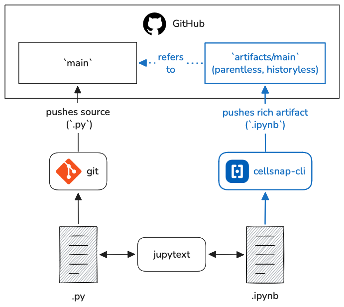

# `cellsnap-cli`

Publish rich notebook snapshots without adding .ipynb files to working git history. Sister tool to [jupytext](https://github.com/jupytext/jupytext).

Push notebook source files (.py) to working branches. Use `cellsnap-cli` to push rich notebooks to parent-less, history-less git branches. These artifact branches only store the latest commit, preventing repo bloat common when committing unstripped .ipynb files. Published notebooks are stamped with frontmatter that refers back to their source and a manifest is added to the artifact branch README.md.
